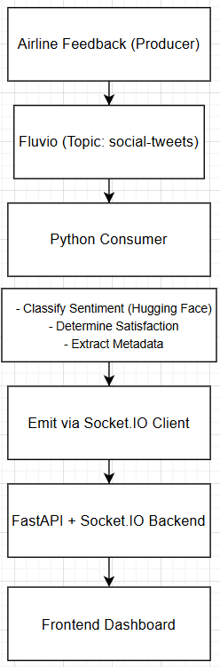
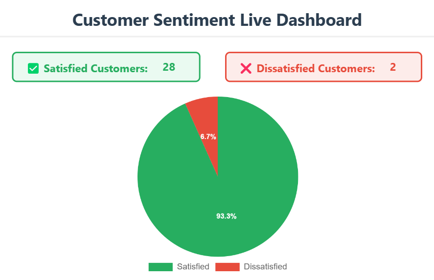
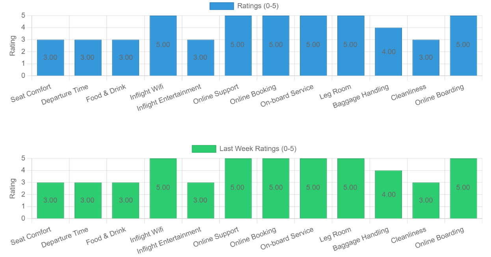
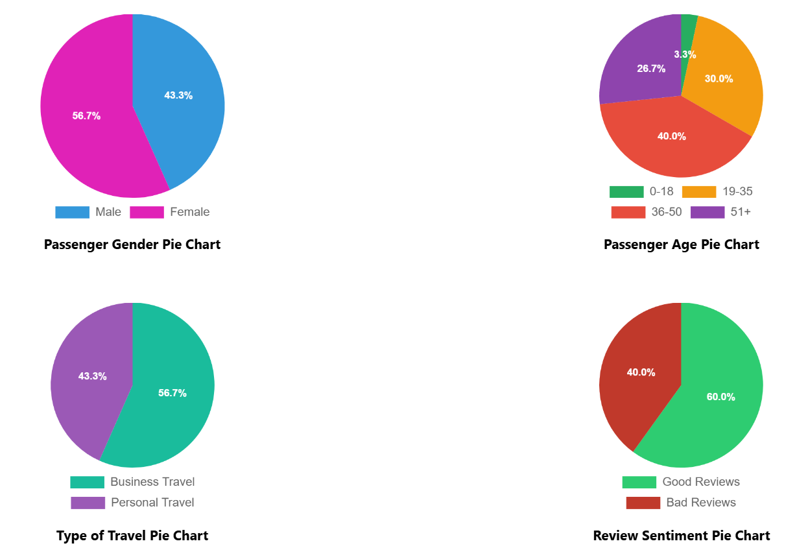
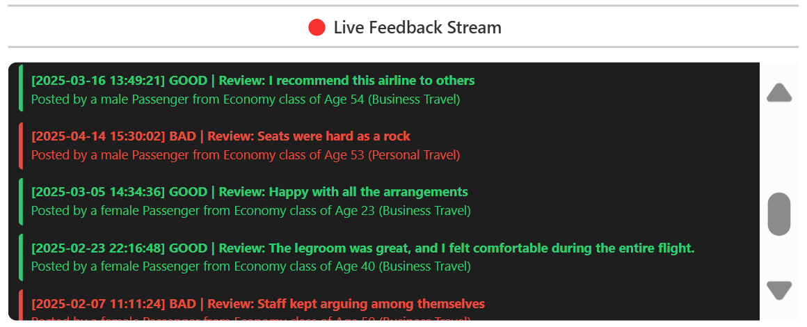

# ✈️ Real-Time Airline Passenger Review Analysis

This project performs **real-time sentiment analysis** and satisfaction classification of airline passenger feedback using **Fluvio** for event streaming, **Socket.IO** for real-time communication, and **FastAPI** as the backend server. It leverages Hugging Face’s DistilBERT for classifying review sentiment.

---

## 📌 Table of Contents

- [Problem Statement](#problem-statement)
- [Solution Overview](#solution-overview)
- [Tech Stack](#tech-stack)
- [System Architecture](#system-architecture)
- [Setup Instructions](#setup-instructions)
- [Screenshots](#screenshots)

---

## ❗ Problem Statement

Airlines receive a massive volume of passenger feedback and service ratings. Analyzing this data manually or in batch mode often leads to delays in identifying negative trends or dissatisfaction.

---

## ✅ Solution Overview

This project provides a **real-time pipeline** to:
- Stream passenger feedback from Fluvio topics.
- Classify review sentiments (good, bad, neutral).
- Determine overall satisfaction using service ratings.
- Emit processed data instantly to a live frontend via Socket.IO.

---

## ⚙️ Tech Stack

- **Backend**: FastAPI, Socket.IO
- **Streaming**: Fluvio
- **NLP Model**: Hugging Face `distilbert-base-uncased-finetuned-sst-2-english`
- **Frontend**: HTML/CSS + Chart.js (or similar, customizable)
- **Language**: Python

---

## 🏗️ System Architecture



---

## ⚙️ Setup Instructions

Follow the steps below to run the project locally:

---

### 📁 1. **Clone the Repository**

```bash
git clone https://github.com/your-username/AIRLINES-SENTIMENT-TRACKER.git
cd AIRLINES-SENTIMENT-TRACKER
```

---

### 🐍 2. **Install Python Dependencies**

Install required packages for each component.

#### a. Producer

```bash
cd producer
pip install -r requirements.txt
```

#### b. Consumer

```bash
cd ../consumer
pip install -r requirements.txt
```

#### c. Backend (FastAPI + Socket.IO)

```bash
cd ../ui/backend
pip install -r requirements.txt
```

---

### 🧪 3. **Start Fluvio Cluster**

Make sure Fluvio is installed. If not, install it:

```bash
curl -fsS https://packages.fluvio.io/install.sh | bash
```

Start a local Fluvio cluster:

```bash
fluvio cluster start
```

Create a topic:

```bash
fluvio topic create social-tweets
```

---

### 🚀 4. **Run the Components**

#### a. Start the Backend Server

```bash
cd ui/backend
python main.py
```

Backend will run at `http://localhost:8000`.

---

#### b. Run the Consumer

```bash
cd consumer
python tweet_sentiment_consumer.py
```

Listens to Fluvio topic and emits data via Socket.IO.

---

#### c. Run the Producer

```bash
cd producer
python tweet_producer.py
```

Produces messages from dataset to Fluvio topic.

---

### 🌐 5. **View the Frontend Dashboard**

Open the following file in your browser:

```
ui/frontend/index.html
```

Make sure the backend is running to receive real-time data.

---

### 🐳 (Optional) Docker Setup

You can create `Dockerfile`s and a `docker-compose.yml` to run everything in containers for production or isolated development.

---

## 🖼️ System Architecture






